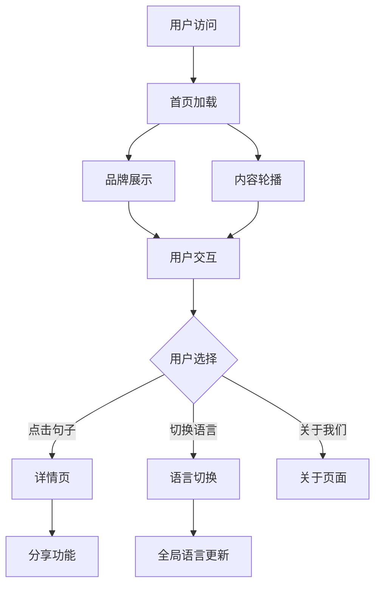

## 1. 产品概述

《天台十句》是一个具有东方美学特色的文化展示平台，通过精美的视觉设计和流畅的交互体验，向用户传达天台文化的深厚内涵。项目旨在重构现有启动界面，升级为符合现代产品标准的高质量首页。

目标用户为对传统文化感兴趣的用户群体，通过数字化展示方式让天台文化焕发新的生命力，提升品牌影响力和用户粘性。

## 2. 核心功能

### 2.1 用户角色

本项目为内容展示型产品，无需用户注册即可访问，暂不考虑用户角色区分。

### 2.2 功能模块

《天台十句》首页重构包含以下核心页面：

1. **首页**：品牌展示区、十句内容轮播、文化背景介绍、双语切换
2. **详情页**：单句详情展示、相关背景故事、分享功能
3. **关于页面**：品牌故事、团队介绍、联系方式

### 2.3 页面详情

| 页面名称 | 模块名称   | 功能描述                            |
| ---- | ------ | ------------------------------- |
| 首页   | 品牌展示区  | 展示《天台十句》品牌标识和核心视觉元素，包含动态背景和品牌口号 |
| 首页   | 十句内容轮播 | 自动轮播展示十句经典内容，支持手动切换和暂停功能        |
| 首页   | 文化背景介绍 | 简洁介绍天台文化历史背景和项目意义               |
| 首页   | 双语切换   | 支持中英文语言切换，默认中文，切换后全局生效          |
| 详情页  | 单句详情展示 | 展示选中句子的完整内容、出处和详细解读             |
| 详情页  | 相关背景故事 | 提供与句子相关的历史故事和文化背景               |
| 详情页  | 分享功能   | 支持生成分享卡片，包含句子内容和品牌标识            |
| 关于页面 | 品牌故事   | 讲述《天台十句》项目的起源和发展历程              |
| 关于页面 | 团队介绍   | 展示项目团队成员信息和贡献                   |
| 关于页面 | 联系方式   | 提供官方联系邮箱和社交媒体链接                 |

## 3. 核心流程

用户访问流程：

1. 用户首次访问首页，看到品牌展示和自动轮播的十句内容
2. 用户可以点击任意句子进入详情页查看完整信息
3. 用户可以通过导航栏切换语言、访问关于页面
4. 支持PWA功能，用户可添加至主屏实现离线访问

## 4. 用户界面设计

### 4.1 设计风格

* **主色调**：深空蓝 (#1a2332) 配金色 (#d4af37) 点缀，体现东方文化的沉稳与尊贵

* **辅助色**：米白色 (#f5f3f0) 作为背景，深灰色 (#2d3748) 用于文字

* **按钮样式**：圆角矩形设计，悬停时有轻微阴影效果

* **字体规范**：中文使用思源黑体，英文使用Inter，标题32-48px，正文16-20px

* **布局风格**：卡片式布局，留白充足，突出内容层次感

* **图标风格**：线性图标，简洁优雅，与整体设计风格统一

### 4.2 页面设计概览

| 页面名称 | 模块名称  | UI元素                                           |
| ---- | ----- | ---------------------------------------------- |
| 首页   | 品牌展示区 | 全屏背景图使用天台山水墨画，品牌标识居中显示，标题使用48px金色字体，副标题24px米白色 |
| 首页   | 内容轮播  | 卡片式展示，每张卡片包含句子内容(28px)、出处(18px)、切换按钮(圆形，40px)  |
| 首页   | 文化背景  | 三栏网格布局，图文结合，标题32px深空蓝，正文18px深灰色                |
| 详情页  | 句子详情  | 大字体展示(36px)居中，背景渐变效果，出处信息使用较小字号(20px)          |
| 详情页  | 背景故事  | 时间轴式设计，图文混排，增强阅读体验                             |
| 关于页面 | 团队介绍  | 网格布局展示成员头像和简介，悬停时有放大效果                         |

### 4.3 响应式设计

采用桌面优先设计策略，确保在大屏幕上展现最佳视觉效果：

* 桌面端：1920x1080 为主要设计分辨率，支持最大2560px宽屏

* 平板端：768px-1024px 自适应，调整网格布局和字体大小

* 移动端：320px-767px 采用单列布局，优化触摸交互

* 所有交互元素最小点击区域48px，确保移动端易用性

### 4.4 性能与无障碍

* 首屏加载时间控制在1.5秒内，使用图片懒加载和代码分割

* 色盲友好设计，确保对比度≥4.5:1

* 完整的键盘导航支持，焦点顺序合理

* ARIA标签完整，支持屏幕阅读器

