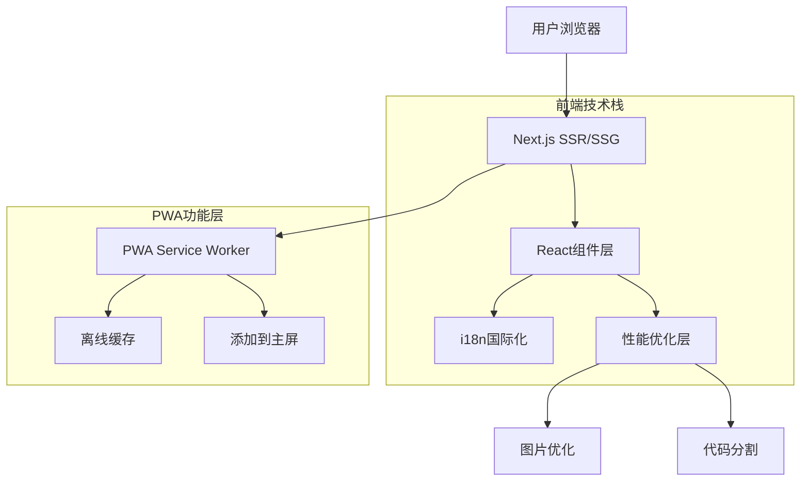

## 1. 架构设计



## 2. 技术描述

- **前端框架**: Next.js 14 + React 18 + TypeScript 5.0
- **初始化工具**: create-next-app
- **样式方案**: Tailwind CSS 3.4 + PostCSS
- **国际化**: next-i18next + i18next
- **PWA支持**: next-pwa + workbox
- **性能监控**: @next/bundle-analyzer
- **测试框架**: Jest 29 + React Testing Library + Cypress
- **视觉回归**: Chromatic
- **代码质量**: ESLint + Prettier + Husky
- **无后端服务**:纯静态站点，使用Next.js SSG功能

## 3. 路由定义

| 路由路径 | 页面用途 | 渲染方式 |
|---------|---------|---------|
| / | 首页，展示品牌内容和十句轮播 | SSG + ISR |
| /quote/[id] | 单句详情页面 | SSG + ISR |
| /about | 关于页面，品牌故事和团队介绍 | SSG |
| /api/revalidate | 缓存刷新API | API Route |

## 4. 核心组件架构

### 4.1 页面级组件
```typescript
// pages/index.tsx
interface HomePageProps {
  quotes: Quote[]
  locale: string
}

// pages/quote/[id].tsx  
interface QuotePageProps {
  quote: Quote
  relatedQuotes: Quote[]
  locale: string
}
```

### 4.2 共享组件类型
```typescript
interface Quote {
  id: string
  content: string
  translation: string
  author: string
  dynasty: string
  background: string
  imageUrl: string
}

interface SEOProps {
  title: string
  description: string
  ogImage: string
  keywords: string[]
}
```

## 5. 国际化实现

### 5.1 语言配置
```typescript
// next-i18next.config.js
const i18nConfig = {
  i18n: {
    defaultLocale: 'zh-CN',
    locales: ['zh-CN', 'en-US'],
  },
  localePath: './public/locales',
  reloadOnPrerender: process.env.NODE_ENV === 'development',
}
```

### 5.2 翻译文件结构
```
public/locales/
├── zh-CN/
│   ├── common.json
│   ├── home.json
│   └── quote.json
└── en-US/
    ├── common.json
    ├── home.json
    └── quote.json
```

## 6. PWA配置

### 6.1 next-pwa配置
```typescript
// next.config.js
const withPWA = require('next-pwa')({
  dest: 'public',
  register: true,
  skipWaiting: true,
  disable: process.env.NODE_ENV === 'development',
  buildExcludes: [/middleware-manifest.json$/],
})
```

### 6.2 缓存策略
- **图片资源**: CacheFirst，30天过期
- **JS/CSS**: StaleWhileRevalidate，1天过期  
- **API响应**: NetworkFirst，5分钟过期
- **HTML文档**: NetworkFirst，支持离线回退

## 7. 性能优化策略

### 7.1 图片优化
- 使用Next.js Image组件自动优化
- WebP格式优先，不支持时回退到JPEG
- 响应式图片，根据屏幕密度加载不同尺寸
- 关键图片预加载，非关键图片懒加载

### 7.2 代码优化
- Tree Shaking移除未使用代码
- 动态import实现代码分割
- 关键CSS内联，非关键CSS异步加载
- 字体子集化，减少字体文件大小

### 7.3 构建优化
- 生产环境启用压缩和混淆
- 提取公共代码到单独chunk
- 使用SWC替代Babel提升编译速度
- 构建缓存加速持续集成

## 8. 测试策略

### 8.1 单元测试
```bash
# 运行所有测试
npm run test

# 运行测试并生成覆盖率报告
npm run test:coverage

# 运行特定组件测试
npm run test:component
```

### 8.2 视觉回归测试
- Chromatic自动检测UI变更
- 关键用户流程截图对比
- 多浏览器兼容性验证
- 移动端和桌面端分别测试

### 8.3 性能测试
- Lighthouse CI集成到CI/CD
- 首屏加载时间<1.5秒
- 交互响应时间<100ms
- 内存使用监控和优化

## 9. 部署配置

### 9.1 环境变量
```bash
# .env.production
NEXT_PUBLIC_SITE_URL=https://tiantai10.com
NEXT_PUBLIC_GA_ID=G-XXXXXXXXXX
NEXT_PUBLIC_CHROMATIC_PROJECT_TOKEN=your_token
```

### 9.2 构建命令
```json
{
  "scripts": {
    "build": "next build",
    "export": "next export",
    "analyze": "ANALYZE=true next build",
    "type-check": "tsc --noEmit"
  }
}
```

### 9.3 CDN配置
- 静态资源使用CDN加速
- 设置合理的缓存头
- 启用Gzip/Brotli压缩
- 配置HTTPS和HSTS